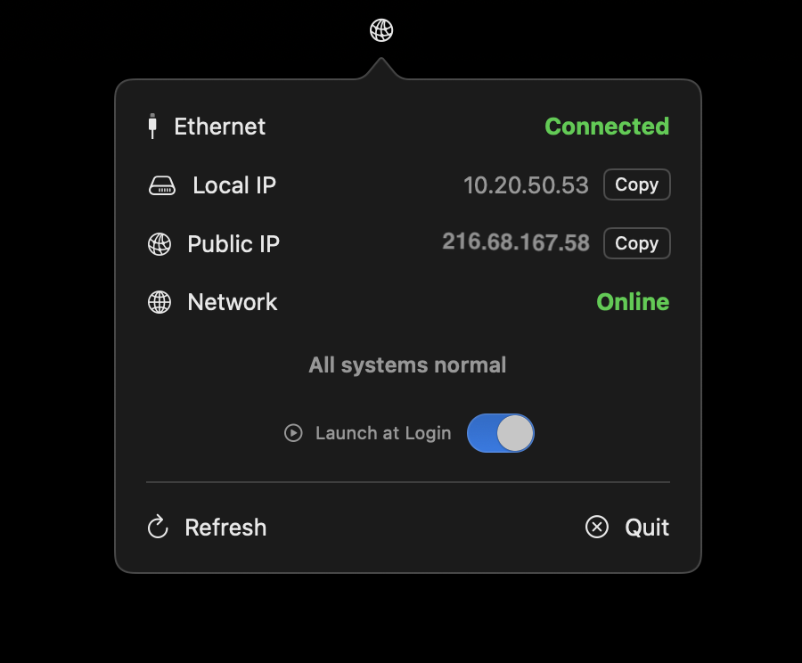

# Nodus Status

**Nodus Status** is a lightweight macOS menu bar utility that monitors your internet and Ethernet connection in real time. Designed with a minimal aesthetic and privacy-first philosophy, it gives users an at-a-glance view of their network health.

---

## 🚀 Features

- ✅ **Always Connected (Green)**: Internet and LAN working perfectly.
- ⚠️ **LAN Only (Yellow)**: Router is up, but DNS or WAN may be unreachable.
- ❌ **Offline (Red)**: No valid IP (e.g., self-assigned 169.x.x.x).

Additional features:
- Displays private and public IP addresses
- Pings your gateway, DNS, and external services for intelligent diagnostics
- Works entirely on-device with no tracking or telemetry
- Auto-refresh every few seconds + manual refresh button
- Built for macOS with native performance and a clean interface

---

## 💡 Philosophy

Nodus Status was created to fill the gap between overcomplicated network tools and vague status indicators. It's:
- **Private**: No data ever leaves your machine.
- **Transparent**: Everything visible and easy to understand.
- **Beautiful**: Minimal UI, dark-friendly, and subtle animations.

---

## 🛠 Built With

- HTML / CSS (custom dark theme, Apple-style UI)
- JavaScript (for UI interaction and animation)
- macOS App (Swift-based menu bar utility – not included here)
- Hosted with [Cloudflare Pages](https://pages.cloudflare.com/)

---

## 📄 Pages

| Page | Description |
|------|-------------|
| `index.html` | Main marketing landing page |
| `privacy.html` | Privacy policy – clear, simple, and user-first |
| `support.html` | Support and contact info (email, GitHub issues) |

---

## 🧠 Coming Soon

- App Store listing
- GitHub Issues for bugs & suggestions
- Localisation support (English, French, more)

---

## 📮 Contact

Need help or want to collaborate?

- 📧 Email: [sheel.patel.dev@gmail.com](mailto:sheel.patel.dev@gmail.com)
- 🌐 Website: [nodus-status.sheel-patel.com](https://nodus-status.sheel-patel.com)

---

## 🛡 Trademark Notice

> Apple, macOS, and the Mac App Store are trademarks of Apple Inc., registered in the U.S. and other countries. This project is not affiliated with or endorsed by Apple.

---

## © 2025 Nodus Status

All rights reserved.
